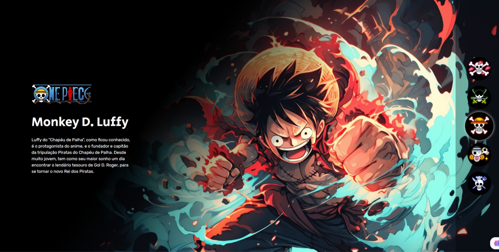

# Projeto One Piece ☠️

Durante a "Semana do zero ao programador contratado", evento emocionante realizado pela @devemdobro de 25 de setembro a 01 de outubro de 2023, tive a oportunidade de participar de um projeto incrível chamado "One Piece". Este projeto foi uma experiência única, onde mergulhamos de cabeça no mundo do desenvolvimento web, utilizando HTML, CSS e JavaScript para criar algo verdadeiramente especial.

O projeto "One Piece" foi inspirado na famosa série de anime e mangá, que é adorada por milhões de fãs em todo o mundo. Nosso objetivo era criar uma página da web interativa que trouxesse um pedacinho desse universo para a internet, permitindo aos fãs explorar e aprender mais sobre seus personagens favoritos.

Primeiramente, utilizamos HTML para criar a estrutura do projeto. Desenhamos cuidadosamente cada elemento da página, organizando-os de maneira atraente e intuitiva. Em seguida, entramos no mundo do CSS para dar vida ao projeto. Foi aqui que aplicamos cores, fontes e estilos para tornar a página visualmente atraente e cativante. Cada detalhe era importante, pois queríamos que os visitantes se sentissem imersos no mundo de "One Piece".

Mas não paramos por aí. A verdadeira magia aconteceu quando começamos a trabalhar com JavaScript. Utilizamos essa linguagem de programação para adicionar funcionalidades aos botões interativos que apresentavam os personagens. Os visitantes podiam clicar nos botões e obter informações detalhadas sobre cada personagem.

<b>Abaixo, temos uma demostração do projeto</b>

  

No final do curso Explorer, temos um módulo que nós permite compreender e entender como aplicar TypeScript em um projeto. Nesse módulo, abordamos os conceitos fundamentais de TypeScript e seu uso na implementação de projetos JavaScript.

Foi explorado tópicos como: tipagens, tipos primitivos, criação de tipagens personalizadas, interfaces, types, generics, e a aplicação de tipos de objetos,  funções e componentes.

## Tech stack
 - HTML
 - CSS
 - JavaScript

## Contact

- [LinkedIn](https://www.linkedin.com/in/henrique-thomazin-068922162/)
- [Instagram](https://www.instagram.com/henriqtho)
